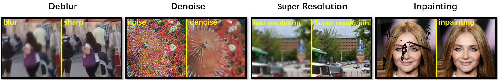
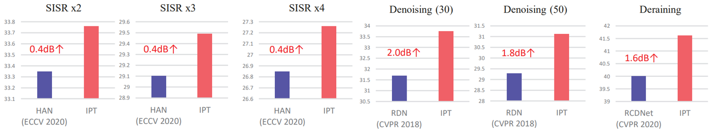
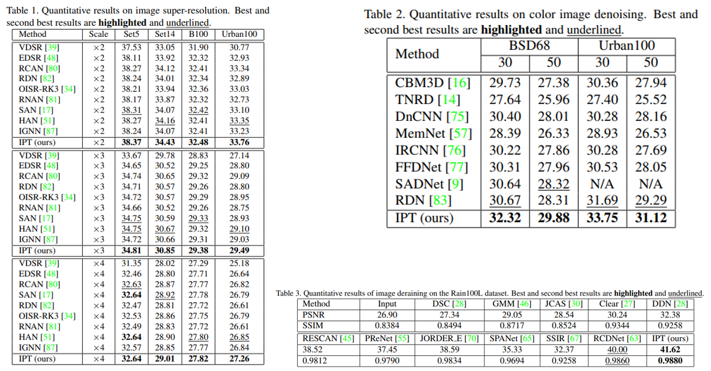
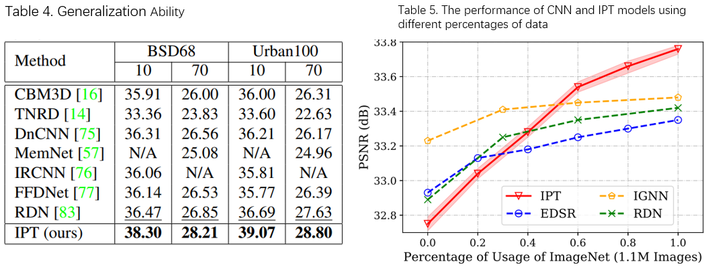
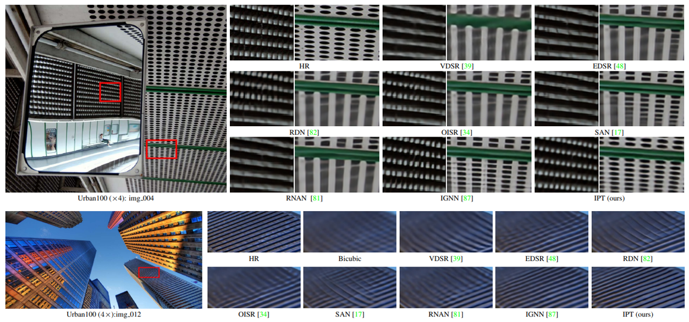
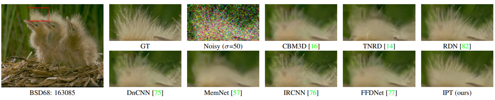
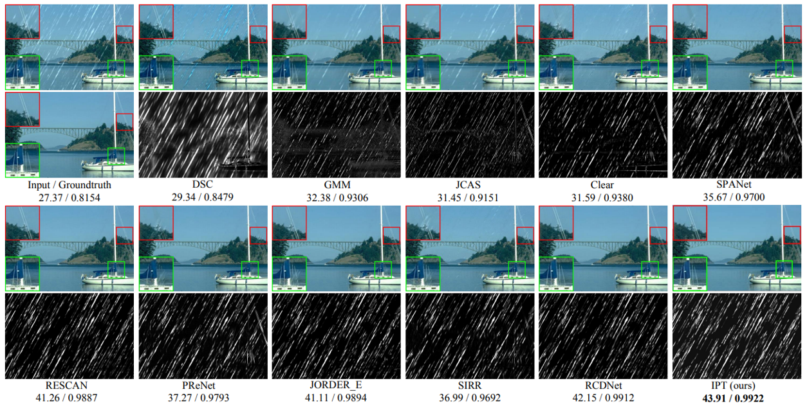

<div align="center">

# MindEditing

English | [中文](README_CN.md)

[Introduction](#introduction) |
[Dependency](#dependency) |
[Get Started](#get-started) |
[News](#news) |
[Tutorials](#tutorials) |
[Model List](#model-list)

</div>

## Introduction

MindEditing is an open-source toolkit based on MindSpore, containing the most advanced image and video task models from
open-source or Huawei Technologies Co. , such as IPT, FSRCNN, BasicVSR and other models. These models are mainly used
for low-level vision task, such as Super-Resolution, DeNoise, DeRain, Inpainting. MindEditing also supports many
platforms, including CPU/GPU/Ascend.Of course, you'll get an even better experience on the Ascend.

<div align="center">
  
</div>

Some Demos:

- **Video super-resolution demo**

<video src="./docs/video/Video_SR_Demo.mp4">
</video>

- **Video frame Interpolation demo**

<video src="./docs/video/Video_frame_Interpolation_Demo_IFRNet.mp4">
</video>

<details open>
<summary>Main features</summary>

- **Easy to use**

  We take the unified entry, you just specify the supported model name and configure the parameters in the parameter yaml file to start your task.
- **Support multiple tasks**

  MindEditing supports a variety of popular and contemporary tasks such as *deblurring*, *denoising*, *super-resolution*, and *inpainting*.
- **SOTA**

  MindEditing provides state-of-the-art algorithms in *deblurring*, *denoising*, *super-resolution*, and *inpainting* tasks.

</details>

## Multi-Task

With so many tasks, is there a model that can handle multiple tasks? Of course, the pre-trained model, namely, image processing transformer ([IPT](docs/ipt.md)).The IPT model is a new pre-trained model,it is trained on these images with multi-heads and multi-tails. In addition, the contrastive learning is introduced for well adapting to different image processing tasks. The pre-trained model can therefore efficiently employed on desired task after finetuning. With only one pre-trained model, IPT outperforms the current state-of-the-art methods on various low-level benchmarks.

<details open>
<summary>Excellent performance</summary>

- **Compared with  the state-of-the-art image processing models on different tasks, the IPT model performs better**

<div align="center">
  
</div>

- **Brush multiple low-level visual tasks**

  *Compared with the state-of-the-art methods,  the IPT model achieve the best performance.*

<div align="center">
  
</div>

- **Generalization Ability**

  *Generation ability(table 4) of the IPT model on color image denoising with different noise levels.*
- **The performance of CNN and IPT models using different percentages of data**

  *When the pre-training data is limited, the CNN model can obtain better performance. With the increase of data volume, the IPT model based on Transformer module gains significant performance improvement, and the curve(table 5) trend also shows the promising potential of the IPT model.*

<div align="center">
  
</div>

- **Amazing actual image inference results**

  - Image Super-resolution task

  *The figure below shows super-resolution results with bicubic downsampling (×4) from Urban100. The proposed IPT model recovers more details.*

  <div align="center">
      
    </div>

  - Image Denoising task

  It must be pointed out that **IPT won CVPR2023 NTIRE Image Denoising track champion.**

  *The figure below shows color image denoising results with noise level σ = 50.*

  <div align="center">
      
    </div>

  - Image Deraining task

  *The figure below shows image deraining results on the Rain100L dataset.*

  <div align="center">
      
    </div>

</details>

## Dependency

- mindspore >=1.9
- numpy =1.19.5
- scikit-image =0.19.3
- pyyaml =5.1
- pillow =9.3.0
- lmdb =1.3.0
- h5py =3.7.0
- imageio =2.25.1
- munch =2.5.0

Python can be installed by Conda.

Install Miniconda:

```shell
cd /tmp
curl -O https://mirrors.tuna.tsinghua.edu.cn/anaconda/miniconda/Miniconda3-py37_4.10.3-Linux-$(arch).sh
bash Miniconda3-py37_4.10.3-Linux-$(arch).sh -b
cd -
. ~/miniconda3/etc/profile.d/conda.sh
conda init bash
```

Create a virtual environment, taking Python 3.7.5 as an example:

```shell
conda create -n mindspore_py37 python=3.7.5 -y
conda activate mindspore_py37
```

Check the Python version.

```shell
python --version
```

To install the dependency, please run:

```shell
pip install -r requirements.txt
```

MindSpore(>=1.9) can be easily installed by following the official [instruction](https://www.mindspore.cn/install) where
you
can select your hardware platform for the best fit. To run in distributed
mode, [openmpi](https://www.open-mpi.org/software/ompi/v4.0/) is required to install.

## Get Started

we provide the boot file of training and validation, chose different model config to start.Please see the [document](tutorials/document.md) for more basic usage of MindEditing.

```shell
python3 train.py --config_path ./configs/basicvsr/train.yaml
# or
python3 val.py --config_path ./configs/basicvsr/val.yaml
```

- Graph Mode and Pynative Mode

  Graph mode is optimized for efficiency and parallel computing with a compiled static graph.
  In contrast, pynative mode is optimized for flexibility and easy development.
  You may alter the parameter system.context_mode in model config file to switch to pure pynative mode for development
  purpose.

## News

MindEditing currently has a branch of 0.x, but it will have a branch of 1.x in the future. You'll find more features in the 1.x branch, so stay tuned.

---

- April 6, 2023

  The model (MPFER) of Efficient View Synthesis and 3D-based Multi-Frame Denoising with Multiplane Feature Representations is coming soon, Stay tuned.
- March 15, 2023

  The inference codes and demos of [Tunable Conv](docs/tunable_conv.md) had already been joined as test case, you can
  find them in ./tests/. Besides, the training codes are
  coming soon. The Tunable Conv has 4 models for demo, NAFNet for modulated image denoising, SwinIR for modulated image
  denoising and perceptual super-resolution, EDSR for modulated joint image denoising and deblurring and StyleNet for
  modulated style transfer.

## Parallel Performance

Increasing the number of parallel work can speed up the training speed. The following is the experiment of example model on CPU 16-core GPU 2xP100:

```text
num_parallel_workers: 8
epoch 1/100 step 1/133, loss = 0.045729052, duration_time = 00:01:07, step_time_avg = 0.00 secs, eta = 00:00:00
epoch 1/100 step 2/133, loss = 0.027709303, duration_time = 00:01:20, step_time_avg = 6.66 secs, eta = 1 day(s) 00:36:02
epoch 1/100 step 3/133, loss = 0.027135072, duration_time = 00:01:33, step_time_avg = 8.74 secs, eta = 1 day(s) 08:17:56

num_parallel_workers: 16
epoch 1/100 step 1/133, loss = 0.04535071, duration_time = 00:00:47, step_time_avg = 0.00 secs, eta = 00:00:00
epoch 1/100 step 2/133, loss = 0.032363698, duration_time = 00:01:00, step_time_avg = 6.74 secs, eta = 1 day(s) 00:54:38
epoch 1/100 step 3/133, loss = 0.02718924, duration_time = 00:01:13, step_time_avg = 8.83 secs, eta = 1 day(s) 08:36:07
```

## Tutorials

The following tutorials are provided to help users learn to use Mindediting.

- [document](tutorials/document.md)

## Model List

| model_name                                       | task                                           | Conference                                                                                                                                                               | Support platform |
| ------------------------------------------------ | ---------------------------------------------- | ------------------------------------------------------------------------------------------------------------------------------------------------------------------------ | ---------------- |
| [IPT](docs/ipt.md)                                  | Multi-Task                                     | [CVPR 2021](https://arxiv.org/abs/2012.00364)                                                                                                                               | Ascend/GPU       |
| [BasicVSR](docs/basicvsr.md)                        | Video Super Resolution                         | [CVPR 2021](https://arxiv.org/abs/2012.02181)                                                                                                                               | Ascend/GPU       |
| [BasicVSR++Light](docs/basicvsr_plus_plus_light.md) | Video Super Resolution                         | [CVPR 2022](https://arxiv.org/abs/2104.13371)                                                                                                                               | Ascend/GPU       |
| [NOAHTCV](docs/noahtcv.md)                          | Image DeNoise                                  | [CVPR 2021(MAI Challenge)](https://arxiv.org/pdf/2105.08629.pdf)                                                                                                            | Ascend/GPU       |
| [RRDB](docs/rrdb.md)                                | Image Super Resolution                         | [ECCVW, 2018](https://arxiv.org/abs/1809.00219)                                                                                                                             | Ascend/GPU       |
| [FSRCNN](docs/fsrcnn.md)                            | Image Super Resolution                         | [ECCV 2016](https://arxiv.org/pdf/1608.00367.pdf)                                                                                                                           | Ascend/GPU       |
| [SRDiff](docs/srdiff.md)                            | Image Super Resolution                         | [Neurocomputing 2022](https://arxiv.org/abs/2104.14951)                                                                                                                     | Ascend/GPU       |
| [VRT](docs/vrt.md)                                  | Multi-Task                                     | [arXiv(2022.01)](https://arxiv.org/abs/2201.12288)                                                                                                                          | Ascend/GPU       |
| [RVRT](docs/rvrt.md)                                | Multi-Task                                     | [arXiv(2022.06)](https://arxiv.org/abs/2206.02146)                                                                                                                          | Ascend/GPU       |
| [TTVSR](docs/ttvsr.md)                              | Video Super Resolution                         | [CVPR 2022](https://arxiv.org/abs/2204.04216)                                                                                                                               | Ascend/GPU       |
| [MIMO-Unet](docs/mimo_unet.md)                      | Image DeBlur                                   | [ICCV 2021](https://arxiv.org/abs/2108.05054)                                                                                                                               | Ascend/GPU       |
| [NAFNet](docs/nafnet.md)                            | Image DeBlur                                   | [arXiv(2022.04)](https://arxiv.org/abs/2204.04676)                                                                                                                          | Ascend/GPU       |
| [CTSDG](docs/ctsdg.md)                              | Image InPainting                               | [ICCV 2021](https://arxiv.org/pdf/2108.09760.pdf)                                                                                                                           | Ascend/GPU       |
| [EMVD](docs/emvd.md)                                | Video Denoise                                  | [CVPR 2021](https://openaccess.thecvf.com/content/CVPR2021/papers/Maggioni_Efficient_Multi-Stage_Video_Denoising_With_Recurrent_Spatio-Temporal_Fusion_CVPR_2021_paper.pdf) | Ascend/GPU       |
| [Tunable_Conv](docs/tunable_conv.md)                | tunable task（image process）                  | [arXiv(2023.04)](https://arxiv.org/abs/2304.00898v1)                                                                                                                        | Ascend/GPU       |
| [IFR+](docs/ifr_plus.md)                            | Video Frame Interpolation                      | [CVPR 2022](https://arxiv.org/abs/2205.14620)                                                                                                                               | Ascend/GPU       |
| [MPFER](docs/mpfer.md)                              | 3D-based Multi-Frame Denoising(is coming soon) | [arXiv(2023.04)](https://arxiv.org/pdf/2303.18139.pdf)                                                                                                                      | GPU              |

Please refer to [ModelZoo Homepage](https://gitee.com/mindspore/models) or the documentation under the folder `docs`for more details on the model.

## License

This project follows the [Apache License 2.0](LICENSE.md) open-source license.

## Feedbacks and Contact

The dynamic version is still under development, if you find any issue or have an idea on new features, please don't
hesitate to contact us via [issue](https://github.com/mindspore-lab/mindediting/issues).

## Acknowledgement

MindSpore is an open source project that welcome any contribution and feedback. We wish that the toolbox and benchmark
could serve the growing research community by providing a flexible as well as standardized toolkit to reimplement
existing methods and develop their own new computer vision methods.

If you find *MindEditing* useful in your research, please consider to cite the following related papers:

```
@misc{MindEditing 2022,
    title={{MindEditing}:MindEditing for low-level vision task},
    author={MindEditing},
    howpublished = {\url{https://github.com/mindspore-lab/mindediting}},
    year={2022}
}

```

## Projects in MindSpore-Lab

- [MindCV](https://github.com/mindspore-lab/mindcv):A toolbox of vision models and algorithms based on MindSpore.
- [MindNLP](https://github.com/mindspore-lab/mindnlp):An opensource NLP library based on MindSpore.
- [MindDiffusion](https://github.com/mindspore-lab/minddiffusion):A collection of diffusion models based on MindSpore.
- [MindFace](https://github.com/mindspore-lab/mindface):MindFace is an open source toolkit based on MindSpore, containing the most advanced face recognition and detection models, such as ArcFace, RetinaFace and other models.
- [MindAudio](https://github.com/mindspore-lab/mindaudio):An open source all-in-one toolkit for the voice field based on MindSpore.
- [MindOCR](https://github.com/mindspore-lab/mindocr):A toolbox of OCR models, algorithms, and pipelines based on MindSpore.
- [MindRL](https://github.com/mindspore-lab/mindrl):A high-performance, scalable MindSpore reinforcement learning framework.
- [MindREC](https://github.com/mindspore-lab/mindrec):MindSpore large-scale recommender system library.
- [MindPose](https://github.com/mindspore-lab/mindpose):an open-source toolbox for pose estimation based on MindSpore.

---
