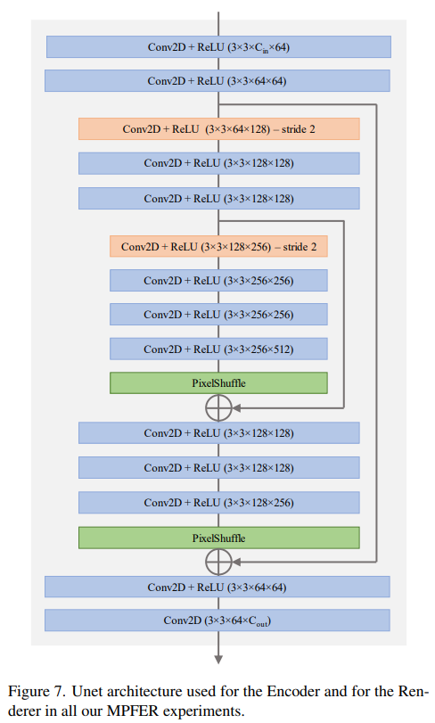

# Contents

- [MPFER Description](#mpfer-description)
- [Model-architecture](#model-architecture)
- [Dataset](#dataset)
- [Environmental requirements](#environmental-requirements)
- [Performance](#performance)
  - [Training performance](#training-performance)
  - [Evaluation performance](#evaluation-performance)

# [MPFER Description](#contents)

We introduce the first 3D-based multi-frame denoising method that significantly outperforms its 2D-based counterparts with lower computational requirements. Our method extends the multiplane image (MPI) framework for novel view synthesis by introducing a learnable encoder-renderer pair manipulating multiplane representations in feature space. The encoder fuses information across views and operates in a depth-wise manner while the renderer fuses information across depths and operates in a view-wise manner. The two modules are trained end-to-end and learn to separate depths in an unsupervised way, giving rise to Multiplane Feature (MPF) representations. Experiments on the Spaces and Real Forward-Facing datasets as well as on raw burst data validate our approach for view synthesis, multi-frame denoising, and view synthesis under noisy conditions.

[Paper](https://arxiv.org/pdf/2303.18139.pdf): Efficient View Synthesis and 3D-based Multi-Frame Denoising with Multiplane Feature Representations.

# [Model architecture](#contents)



# [Dataset](#contents)

The Spaces dataset consists of 100 indoor and outdoor scenes, captured 5 to 10 times each using a 16-camera rig placed at slightly different locations. 90 scenes are used for training and 10 scenes are held-out for evaluation. The resolution of the images is 480×800.

The data set format is as follows:

```
|--data
| |--scene_000
| | |--cam_00
| | | |--image_000.JPG
| | | |--...
| | |--cam_01
| | | |--image_000.JPG
| | | |--...
| | |--...
| | |--models.json
| | |--multi_model.pb.bin
| |--scene_009
| | |--cam_00
| | | |--image_000.JPG
| | | |--...
| | |--cam_01
| | | |--image_000.JPG
| | | |--...
| | |--...
| | |--models.json
| | |--multi_model.pb.bin
| |--...
```

# [Environmental requirements](#contents)

## GPU

- Hardware (GPU)
  - Prepare hardware environment with GPU processor
- Framework
  - [MindSpore](https://www.mindspore.cn/install)
- For details, see the following resources:
  - [MindSpore Tutorial](https://www.mindspore.cn/tutorials/zh-CN/master/index.html)
  - [MindSpore Python API](https://www.mindspore.cn/docs/zh-CN/master/index.html)
- Additional python packages:
  - Install additional packages manually or using `pip install -r requirements.txt` command in the model directory.

## Ascend 910

- Hardware (Ascend)
  - Prepare hardware environment with Ascend 910 (cann_5.1.2, euler_2.8.3, py_3.7)
- Framework
  - [MindSpore 2.0.0](https://www.mindspore.cn/install) or later

# [Performance](#contents)

## [Training Performance](#contents)

Training is not supported temporarily.

## [Evaluation Performance](#contents)

| Model   | PSNR  | SSIM |
| ------- | ----- | ---- |
| MPFER16 | 32.44 | 0.91 |
