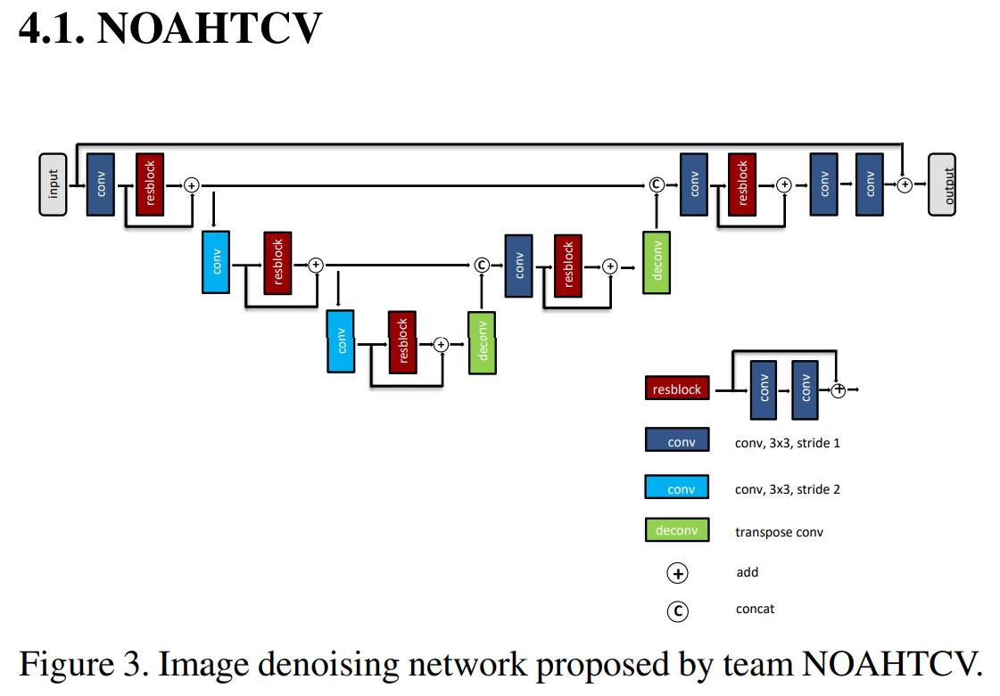

# [模型](#内容)

## NoahTCV Description

NOAHTCV团队成为2021年移动人工智能挑战赛的获胜者。他们应用神经结构搜索来寻找图像去噪任务的最佳模型。
在这里你可以找到最终的架构。

[论文](https://arxiv.org/pdf/2105.08629.pdf): Fast Camera Image Denoising on Mobile GPUs with Deep Learning, Mobile AI 2021 Challenge: Report.


# [网络](#内容)



# [脚本](#内容)

```text
.
└─ cv
  └─ Noahtcv
    ├─ cfg                                 # Example configs for running on GPU and Ascend
    ├─ src
      ├─ callback.py                       # Callbacks for train and eval
      ├─ loss.py                           # Loss function
      ├─ metric.py                         # Metrics
      ├─ model.py                          # Noahtcv architecture
    ├─ requirements.txt                    # requirements
    └─ README.md                           # Noahtcv file English description
```


# [数据集](#内容)

挑战训练数据集可从 [cite](https://competitions.codalab.org/competitions/28120#participate-get-data)下载。有658张图片，3000x4000px。

需要进行离线预处理来准备数据集:从每个训练图像step=192中裁剪出256x256图像，然后进行重组。所以一共有197400张RGB图片:

```
|--train
| |--sharp
| | |--000000.jpeg
| | |--000001.jpeg
| | |--...
| | |--197399.jpeg
| |--noisy
| | |--000000.jpeg
| | |--...
| | |--197399.jpeg
```

为了提高图像质量，在真实图像中加入了合成随机噪声。

评估可以在 [CBSD68](https://www2.eecs.berkeley.edu/Research/Projects/CS/vision/bsds/) 数据集上进行。
```
|--test
| |--noisy5
| | |--0000.png
| | |--0001.png
| | |--...
| | |--0067.png
| |--noisy10
| | |--0000.png
| | |--0001.png
| | |--...
| | |--0067.png
| |--noisy15
| | |--0000.png
| | |--0001.png
| | |--...
| | |--0067.png
| |--noisy25
| | |--0000.png
| | |--0001.png
| | |--...
| | |--0067.png
| |--noisy35
| | |--0000.png
| | |--0001.png
| | |--...
| | |--0067.png
| |--noisy50
| | |--0000.png
| | |--0001.png
| | |--...
| | |--0067.png
| |--original_png
| | |--0000.png
| | |--0001.png
| | |--...
| | |--0067.png
```

# 训练过程

## 训练参数

对于Ascend上的训练，`is_use_dynamic_loss_scale`应该设置为True。

| 参数           | 值                                                           |
| -------------- | ------------------------------------------------------------ |
| 模型           | NoahTCV                                                      |
| 资源           | 1x Tesla V100-SXM2-32GB, Ascend-910A                         |
| MindSpore 版本 | 1.9.0                                                        |
| 数据集         | MAI21Denoising, 300 crops per image with step=192, total - 197400 images |
| 加强           | Synthetic random noise                                       |
| 输入块大小     | 256x256                                                      |
| 训练参数       | batch_size=64, lr=0.0001 and cosine after 50 epochs, use_bn = False |
| 优化器         | Adam                                                         |
| 总轮次         | 200                                                          |

## 质量/性能

| 参数             | 值                                                           |
| ---------------- | ------------------------------------------------------------ |
| 模型             | NoahTCV                                                      |
| 资源             | 1x Tesla V100, Ascend-910A                                   |
| MindSpore 版本   | 1.9.0                                                        |
| 数据集           | CBSD68, noise level = 50                                     |
| 输入块大小       | 480x320 (input 481x321 is resized down to 1 px to suit UNET architecture) |
| 一次处理数据数目 | 1                                                            |

使用带有真实噪声的挑战数据集训练模型的PSNR:

| 模型       | 设备类型 | 规格        | 评估 PSNR (dB)    |
| ---------- | -------- | ----------- | ----------------- |
| Noahtcv-MS | GPU      | v100        | 18.07 (epoch 200) |
| Noahtcv-MS | Ascend   | Ascend-910A | 17.65 (epoch 60)  |

由于在原始数据集上训练的模型在CBSD68上的结果不理想，最终参数文件在挑战的真实数据上使用合成噪声进行训练，精度有显著提高。

| 模型       | 设备类型   | 规格        | 评估 PSNR (dB) | 每个轮次训练时间, s |
| ---------- | ---------- | ----------- | -------------- | ------------------- |
| Noahtcv-MS | 1 x GPU    | v100        | 26.718         | 775                 |
| Noahtcv-MS | 1 x Ascend | Ascend-910A | 26.797         | 989                 |

# 推理性能

| 模型       | 设备类型 | 规格        | 每个步奏时间, s (batch size=1) |
| ---------- | -------- | ----------- | ------------------------------ |
| Noahtcv-MS | GPU      | v100        | 0.004                          |
| Noahtcv-MS | Ascend   | Ascend-910A | 0.005                          |
